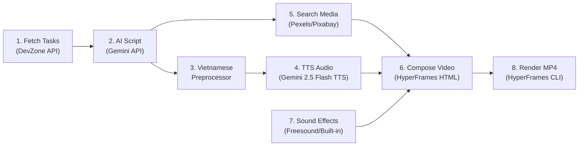

# Daily Report AI Video Generator

Tạo video báo cáo công việc hàng ngày (~60 giây) tự động từ danh sách task trên DevZone, sử dụng AI để viết kịch bản chuyên nghiệp, TTS để tạo giọng đọc tiếng Việt, và HyperFrames để render video MP4 với animation đẹp mắt.

## Tổng quan kiến trúc



## Tech Stack

| Thành phần | Công nghệ | Lý do chọn |
|---|---|---|
| Runtime | Node.js 22+ | Yêu cầu của HyperFrames |
| Task API | DevZone REST API | API hiện có của Vietnix |
| AI Script | Gemini 2.5 Flash (`@google/genai`) | Miễn phí, hỗ trợ tiếng Việt tốt |
| TTS | **Gemini 2.5 Flash TTS** (omni) | Cùng API key với script gen, 30+ voices, giọng Việt tự nhiên, prosody control bằng ngôn ngữ tự nhiên |
| VN Preprocessor | Custom module | Chuyển đổi phát âm: "vietnix" → "việt nít", "deploy" → "đi-ploi" |
| Stock Images | Pexels / Pixabay API | Miễn phí, royalty-free, API tốt |
| Sound Effects | Freesound API + built-in SFX | Whoosh, notification, transition sounds |
| Background Music | Pixabay Music API | Royalty-free, không cần attribution |
| Video Engine | HyperFrames (HTML → MP4) | Open-source, deterministic rendering |
| Animation | GSAP | Seekable, frame-accurate animations |
| Render | FFmpeg + Chromium (headless) | HyperFrames built-in |

---

## User Review Required

> [!IMPORTANT]
> **Gemini API Key**: Project sẽ dùng **1 API key duy nhất** cho cả script generation VÀ TTS (Gemini 2.5 Flash). Cung cấp key qua biến môi trường `GEMINI_API_KEY`.

> [!IMPORTANT]
> **Giọng đọc TTS**: Gemini TTS có 30+ voices. Mặc định dùng voice phù hợp tiếng Việt nhất. Có thể điều chỉnh prosody bằng prompt tự nhiên (VD: "đọc chậm, giọng chuyên nghiệp và tự tin").

> [!WARNING]
> **Token API DevZone**: Token Bearer bạn cung cấp có thời hạn (`exp: 1780408527` ~ khoảng vài giờ). Cần đảm bảo token còn hiệu lực khi chạy, hoặc thêm cơ chế refresh token.

## Open Questions

1. **Số lượng task hiển thị trong video**: Nên giới hạn bao nhiêu task trong 1 video 60s? Đề xuất: **3-5 task** để mỗi task có đủ thời gian giới thiệu (~10-12s/task).
2. **Branding**: Có muốn thêm logo Vietnix vào video không? Nếu có, cung cấp file logo.
3. **Nhạc nền**: Có muốn thêm nhạc nền nhẹ (lofi/corporate) không? Nếu có, cung cấp file hoặc để AI chọn từ royalty-free.
4. **Văn phong**: Bạn thích mẫu báo cáo nào trong 3 mẫu ví dụ? (Chuyên nghiệp kỹ thuật / Storytelling / Ngắn gọn bullet-point)

---

## Proposed Changes

### 1. Project Foundation

#### [NEW] [package.json](file:///Users/truong/Documents/vietnix/daily-report-ai/package.json)
- TypeScript project với các dependencies:
  - `hyperframes` - Video rendering engine
  - `@google/genai` - Gemini API cho cả script generation + TTS (omni)
  - `gsap` - Animation engine
  - `pexels` - Stock image/video API client
  - `dotenv` - Environment variables
  - `wavefile` - Xử lý PCM → WAV output từ Gemini TTS
  - `tsx` - TypeScript runner
  - `typescript` - TypeScript compiler
- Scripts: `generate`, `preview`, `render`

#### [NEW] [tsconfig.json](file:///Users/truong/Documents/vietnix/daily-report-ai/tsconfig.json)
- Target: `ES2022`, Module: `NodeNext`
- Strict mode enabled

#### Prerequisites (cần cài trước)
- **Node.js 22+** (`node -v` → v22.x)
- **FFmpeg** (`ffmpeg -version`) — cần cho HyperFrames render + audio conversion
- **Gemini API Key** — lấy từ [aistudio.google.com](https://aistudio.google.com)
- **Pexels API Key** — lấy từ [pexels.com/api](https://www.pexels.com/api/)

#### [NEW] [.env.example](file:///Users/truong/Documents/vietnix/daily-report-ai/.env.example)
```env
GEMINI_API_KEY=your_gemini_api_key
DEVZONE_TOKEN=Bearer eyJ...
DEVZONE_PROJECT_ID=9iTDI35yTcNirDxO
DEVZONE_ASSIGNEE_ID=LwWlENeJJK9G60v
TTS_MODEL=gemini-2.5-flash-preview-tts
TTS_VOICE=Kore
TTS_STYLE=Đọc chậm, rõ ràng, giọng chuyên nghiệp và tự tin
VIDEO_DURATION=60
PEXELS_API_KEY=your_pexels_api_key
PIXABAY_API_KEY=your_pixabay_api_key
```

---

### 2. API Integration Module

#### [NEW] [src/fetch-tasks.ts](file:///Users/truong/Documents/vietnix/daily-report-ai/src/fetch-tasks.ts)
- Gọi API DevZone: `GET /workspace/projects/{projectId}/tasks`
- Parse response, extract các trường quan trọng:
  - `title` - Tên task
  - `status` - Trạng thái (Done, In Progress, etc.)
  - `priority` - Độ ưu tiên
  - `createdAt` - Ngày tạo
  - `description` - Mô tả chi tiết
  - `tags/labels` - Nhãn phân loại
- Lọc và sắp xếp: ưu tiên task mới nhất, task đã hoàn thành
- Export: `fetchTasks()` → Array of formatted tasks

---

### 3. AI Script Generation Module

#### [NEW] [src/generate-script.ts](file:///Users/truong/Documents/vietnix/daily-report-ai/src/generate-script.ts)
- Input: Danh sách tasks đã format
- Sử dụng Gemini API để tạo kịch bản video theo format:
  ```json
{
  "intro": {
    "text": "Chào các con vợ nhá! Lại là bảnh đây. Ngồi xuống uống miếng nước, ăn miếng bánh để bảnh check-in sương sương cái tiến độ task tuần qua xem có gì hot nào.",
    "duration": 10
  },
  "tasks": [
    {
      "title": "Web Automation với Playwright & Setup VPS",
      "narration": "Tuần qua bảnh đã dồn hết công lực để trị con app này. Cụ thể là đã vắt óc code xong quả logic xử lý Web Automation bằng Playwright mượt như lụa. Bảnh cũng đã cấu hình quả `storageState` siêu cấp vip pro để cứu vớt anh em khỏi kiếp nạn re-login, cookies giờ đây bất tử, ôm nhau sống qua ngày đoạn tháng trên môi trường Headless VPS. Code đã chạy bon bon, mô phỏng User-Agent chuẩn chỉ như người thật, chấp cả các loại quét checkpoint của hệ thống luôn nhé các con vợ!",
      "status": "Completed (Đã xong xuôi, mượt mà)",
      "highlights": ["Playwright", "StorageState", "Headless VPS", "Bất tử Cookies", "Anti-Checkpoint"],
      "duration": 20
    },
    {
      "title": "Refactor Code & Tối ưu hóa hiệu năng",
      "narration": "Chưa hết đâu nhá, bảnh còn rảnh tay dọn rác, refactor lại toàn bộ cái đống module quản lý session. Code sạch đẹp, tối ưu VPS nhanh hơn 20%!",
      "status": "Completed (Ngon lành cành đào)",
      "highlights": ["Refactor", "Clean Code", "Optimize VPS"],
      "duration": 12
    }
  ],
  "summary": {
    "text": "Tổng kết lại tuần này: Gõ phím không ngừng nghỉ, gánh còng cả lưng để hoàn thành trọn vẹn các task core về tự động hóa. Mọi chỉ số đều xanh mướt, timeline bám sát nút, code đã lên nhánh develop chờ các con vợ vào review xem bảnh có nói điêu câu nào không!",
    "duration": 12
  },
  "closing": {
    "text": "Thế thôi, báo cáo thế là quá chi tiết và uy tín rồi. Cảm ơn các con vợ đã lắng nghe bảnh gáy. Giải tán đi làm việc tiếp nào, hẹn gặp lại vào tuần sau!",
    "duration": 7
  }
}
  ```
- Prompt engineering: Văn phong **vui nhộn, hài hước, dí dỏm** như youtuber tech Việt Nam, kết hợp tiếng Anh chuyên ngành
- Tự động tính toán duration cho mỗi phân cảnh để tổng **đúng 60s** (intro 10s + tasks 30-35s + summary 10s + closing 5-7s)
- Cho phép chọn nhiều style qua CLI: `--tone fun` / `--tone professional` / `--tone casual`

---

### 4. Vietnamese Text Preprocessor (TTS Enhancement Layer)

#### [NEW] [src/vietnamese-preprocessor.ts](file:///Users/truong/Documents/vietnix/daily-report-ai/src/vietnamese-preprocessor.ts)
Lớp tiền xử lý văn bản trước khi đưa cho TTS để đảm bảo phát âm chính xác:

**Pronunciation Dictionary** (có thể mở rộng):
```javascript
const PRONUNCIATION_MAP = {
  // Brand names
  'vietnix': 'việt nít',
  'devzone': 'đèv zôn',
  
  // Tech terms thường bị đọc sai
  'deploy': 'đi-ploi',
  'CI/CD': 'xi ai xi đi',
  'API': 'ây pi ai',
  'frontend': 'phờ-ren-en',
  'backend': 'bách-en',
  'refactor': 'ri-phác-tơ',
  'merge': 'mơ-dz',
  'PR': 'pi a',
  'bug': 'bấc',
  'debug': 'đi-bấc',
  'sprint': 'xờ-print',
  'scrum': 'xơ-crầm',
  'agile': 'a-dai-ồ',
  'docker': 'đóc-cơ',
  'kubernetes': 'ku-bơ-nê-tít',
  'nginx': 'en-gin-éc',
  'Redis': 'rê-đít',
  'MongoDB': 'moong-gô đi-bi',
  'PostgreSQL': 'pốt-grét ét-kiu-eo',
  'Playwright': 'plây-rai',
  'Headless': 'hét-lét',
  'VPS': 'vi pi ét',
  'storageState': 'xtô-rít xtết',
  'Vietnix': 'việt nít',
  'DevZone': 'đép dôn',
  'Task': 'tác-k',
  'PR': 'pi a'
  // ... có thể mở rộng thêm
};
```

**Xử lý thông minh:**
- Case-insensitive matching
- Giữ nguyên context xung quanh từ
- Hỗ trợ regex patterns cho các dạng viết tắt (e.g., `v2.1.0` → "phiên bản 2 chấm 1 chấm 0")
- Xử lý số, URL, email thành dạng đọc được
- Cho phép user bổ sung dictionary qua file `pronunciation.json`

---

### 5. Text-to-Speech Module (Gemini Omni TTS)

#### [NEW] [src/generate-audio.ts](file:///Users/truong/Documents/vietnix/daily-report-ai/src/generate-audio.ts)
- Dùng **Gemini 2.5 Flash TTS** (model `gemini-2.5-flash-preview-tts`) — cùng API key với script generation
- **Ưu điểm so với Edge TTS:**
  - Không cần SSML phức tạp — điều khiển prosody bằng **ngôn ngữ tự nhiên**
  - VD prompt: "Đọc đoạn sau với giọng chuyên nghiệp, tự tin, tốc độ vừa phải"
  - 30+ voices có sẵn (Kore, Charon, Fenrir, Aoede...)
  - Hỗ trợ multi-speaker (đa giọng trong 1 đoạn)
  - Output PCM 24kHz → convert WAV/MP3 bằng `wavefile` + `ffmpeg`

- **API Call Pattern:**
  ```typescript
  import { GoogleGenAI } from '@google/genai';
  
  const ai = new GoogleGenAI({ apiKey: process.env.GEMINI_API_KEY });
  const response = await ai.models.generateContent({
    model: 'gemini-2.5-flash-preview-tts',
    contents: [{
      role: 'user',
      parts: [{ text: 'Đọc chuyên nghiệp: Chào các bạn, đây là báo cáo công việc...' }]
    }],
    config: {
      responseModalities: ['AUDIO'],
      speechConfig: {
        voiceConfig: {
          prebuiltVoiceConfig: { voiceName: 'Kore' }
        }
      }
    }
  });
  // response → PCM audio data (base64) → decode → WAV file
  ```

- **Pipeline:**
  1. Nhận text từ script
  2. Chạy qua `vietnamese-preprocessor.ts` → text đã chuẩn phát âm
  3. Kết hợp text + style prompt ("đọc chuyên nghiệp, rõ ràng")
  4. Gọi Gemini TTS → PCM audio data
  5. Convert PCM → WAV (dùng `wavefile`) → MP3 (dùng `ffmpeg`)
  6. Đo duration thực tế (dùng `ffprobe`)
  7. Cập nhật lại timing trong script để khớp
- Tạo file audio riêng cho từng phân cảnh:
  - `audio/intro.wav`
  - `audio/task-1.wav`, `audio/task-2.wav`, ...
  - `audio/summary.wav`
  - `audio/closing.wav`
- Hỗ trợ điều chỉnh qua `.env`: voice name (`TTS_VOICE`), style prompt (`TTS_STYLE`)

---

### 6. Stock Media Integration

#### [NEW] [src/fetch-media.ts](file:///Users/truong/Documents/vietnix/daily-report-ai/src/fetch-media.ts)
Tự động tìm và tải hình ảnh/video liên quan đến nội dung task:

**Image Search (Pexels + Pixabay):**
- AI phân tích mỗi task → extract keywords phù hợp cho stock search
  - VD: Task "Web Automation" → keywords: `["coding", "automation", "laptop programming"]`
  - VD: Task "Database optimization" → keywords: `["server room", "data center", "technology"]`
- Gọi Pexels API: `GET /v1/search?query={keyword}&orientation=landscape&size=medium`
- Fallback sang Pixabay nếu Pexels không có kết quả phù hợp
- Download ảnh về `assets/images/task-{n}/`
- **Ưu tiên**: landscape orientation, min 1920x1080, dark/tech aesthetic

**Background Video Clips (Pexels Videos):**
- Search short video clips cho intro/outro (abstract tech, particles, code)
- `GET /videos/search?query=technology+abstract&orientation=landscape&size=medium`
- Crop/trim tự động bằng FFmpeg

#### [NEW] [src/fetch-sfx.ts](file:///Users/truong/Documents/vietnix/daily-report-ai/src/fetch-sfx.ts)
Sound effects cho transitions & highlights:

**Built-in SFX Pack** (đóng gói sẵn, không cần API):
- `assets/sfx/whoosh.mp3` - Transition giữa các scene
- `assets/sfx/notification.mp3` - Khi hiển thị task mới
- `assets/sfx/typing.mp3` - Code typing effect
- `assets/sfx/success.mp3` - Task completed
- `assets/sfx/subtle-pop.mp3` - Tag/badge appear

**Freesound API (Optional, nếu cần thêm):**
- Search: `GET /apiv2/search/text/?query=whoosh+transition&filter=duration:[0 TO 3]`
- Download CC0-licensed sounds
- Cache locally để không cần gọi lại

---

### 7. HyperFrames Video Composition (Enhanced with Media)

#### [NEW] [src/compose-video.ts](file:///Users/truong/Documents/vietnix/daily-report-ai/src/compose-video.ts)
- Tạo file HTML composition từ script + audio + stock media + SFX
- Generate file `composition/index.html` với cấu trúc HyperFrames

#### [NEW] [composition/index.html](file:///Users/truong/Documents/vietnix/daily-report-ai/composition/index.html) (generated)
Cấu trúc video gồm các scene:

**Scene 1 - Intro (0s-8s):**
- 🎬 Background: Stock video abstract tech / particles (từ Pexels)
- Logo/Avatar fade-in
- Title: "DAILY STATUS REPORT – 02/06/2026"
- Subtitle: Tên người báo cáo
- 🔊 SFX: Subtle whoosh intro
- 🎙️ Audio narration intro
- 🎵 Background music fade-in (volume 0.15)

**Scene 2-4 - Task Details (8s-44s, ~12s/task):**
- 🖼️ Background: Stock image liên quan task (coding, server, etc.)
- Task title slide-in từ trái + 🔊 SFX notification
- Status badge animation (pulse effect cho "Completed") + 🔊 SFX success
- Keyword tags fly-in + 🔊 SFX subtle-pop
- Progress bar animation
- Technical highlights với typing effect + 🔊 SFX typing
- 🔊 SFX whoosh transition giữa các task
- 🎙️ Audio narration cho mỗi task

**Scene 5 - Summary (44s-52s):**
- 🖼️ Background: Dashboard/analytics stock image
- Stats dashboard: số task completed, in-progress
- Mini chart animation (bar chart hoặc pie chart)
- Key metrics highlight
- 🎙️ Audio summary narration

**Scene 6 - Closing (52s-60s):**
- 🎬 Background: Stock video abstract/gradient
- "Next Steps" bullet points animation
- Thank you message
- Social/contact info
- 🎵 Background music fade-out
- Fade out

#### [NEW] [composition/styles.css](file:///Users/truong/Documents/vietnix/daily-report-ai/composition/styles.css)
- Dark theme professional design
- Custom CSS animations cho transitions
- Typography: Inter / Roboto Mono cho code
- Color palette: Vietnix brand colors (nếu có) hoặc tech gradient (#667eea → #764ba2)
- Glassmorphism effect cho cards
- Image overlay/dimming filters cho stock backgrounds

#### [NEW] [composition/animations.js](file:///Users/truong/Documents/vietnix/daily-report-ai/composition/animations.js)
- GSAP timeline cho toàn bộ video
- Seekable animations cho mỗi scene
- Effects:
  - Text reveal (letter by letter)
  - Slide-in / slide-out
  - Scale + fade transitions
  - Ken Burns effect trên stock images (slow zoom/pan)
  - Particle effects background
  - Typing animation cho code snippets
  - Counter animation cho stats

---

### 8. Main Pipeline & CLI

#### [NEW] [src/index.ts](file:///Users/truong/Documents/vietnix/daily-report-ai/src/index.ts)
- Main entry point, orchestrate toàn bộ pipeline:
  ```
  1. fetchTasks()                → tasks data
  2. generateScript(tasks)       → video script  
  3. fetchMedia(script)          → stock images/videos + SFX
  4. preprocessVietnamese(script)→ TTS-ready text
  5. generateAudio(script)       → audio files + updated timings
  6. composeVideo(script, media) → HTML composition
  7. renderVideo()               → MP4 output
  ```
- CLI arguments:
  - `--preview` : Mở preview trong browser
  - `--render` : Render ra MP4
  - `--output <path>` : Đường dẫn output MP4
  - `--voice <name>` : Chọn giọng TTS
  - `--style <type>` : Chọn style (professional/casual/minimal)
  - `--no-media` : Bỏ qua stock media (dùng gradient backgrounds)
  - `--no-sfx` : Bỏ qua sound effects

#### [NEW] [src/render-video.ts](file:///Users/truong/Documents/vietnix/daily-report-ai/src/render-video.ts)
- Wrapper cho HyperFrames CLI render
- Gọi `npx hyperframes render --output daily-report-{date}.mp4`
- Log progress, handle errors
- Auto-open file sau khi render xong

---

### 9. Các tính năng bổ sung

#### Background Music (Pixabay Music)
- [NEW] [src/fetch-music.ts](file:///Users/truong/Documents/vietnix/daily-report-ai/src/fetch-music.ts)
- Auto-search nhạc nền phù hợp từ Pixabay Music API:
  - Categories: `corporate`, `technology`, `ambient`, `lofi`
  - Duration filter: 60-120s
  - Mood: `inspiring`, `calm`, `professional`
- Download về `assets/bgm/`
- Fallback: built-in `assets/bgm/default-corporate.mp3`
- Tự động mix: narration (volume: 1.0) + BGM (volume: 0.12) + SFX (volume: 0.3)
- Fade in (0-2s) / fade out (last 3s)

#### Auto-Generated Thumbnails
- [NEW] `src/generate-thumbnail.js` - Screenshot frame đầu tiên làm thumbnail
- Export thumbnail cùng video

#### Template System
- [NEW] `templates/professional.html` - Dark theme, corporate
- [NEW] `templates/minimal.html` - Clean, simple  
- [NEW] `templates/creative.html` - Colorful, dynamic
- Cho phép chọn template qua CLI flag

#### Subtitle/Caption Overlay
- Auto-generate SRT subtitle từ script
- Hiển thị caption đồng bộ với audio narration
- Animated caption (word-by-word highlight)

#### Vietnamese Pronunciation Config
- [NEW] [pronunciation.json](file:///Users/truong/Documents/vietnix/daily-report-ai/pronunciation.json)
- User có thể bổ sung custom pronunciation mappings:
  ```json
  {
    "vietnix": "việt nít",
    "marops": "ma-rốp",
    "custom-term": "phát-âm-đúng"
  }
  ```
- Tự động merge với built-in dictionary

---

## Cấu trúc thư mục cuối cùng

```
daily-report-ai/
├── package.json
├── tsconfig.json               # TypeScript config
├── .env
├── .env.example
├── .gitignore                  # Ignore: .env, node_modules, audio/, assets/images, output/
├── pronunciation.json          # Custom pronunciation mappings
├── src/
│   ├── index.ts                # Main pipeline orchestrator
│   ├── fetch-tasks.ts          # DevZone API client
│   ├── generate-script.ts      # AI script generation (Gemini)
│   ├── vietnamese-preprocessor.ts # TTS pronunciation fixer
│   ├── generate-audio.ts       # TTS audio synthesis (Gemini omni TTS)
│   ├── fetch-media.ts          # Stock images/videos (Pexels/Pixabay)
│   ├── fetch-sfx.ts            # Sound effects manager  
│   ├── fetch-music.ts          # Background music (Pixabay Music)
│   ├── compose-video.ts        # HTML composition generator
│   ├── render-video.ts         # HyperFrames render wrapper
│   ├── generate-thumbnail.ts   # Thumbnail generator
│   └── types.ts                # Shared TypeScript interfaces
├── composition/                # Generated HyperFrames composition
│   ├── index.html
│   ├── styles.css
│   └── animations.js           # GSAP (must be .js for browser)
├── templates/                  # Video style templates
│   ├── professional.html
│   ├── minimal.html
│   └── creative.html
├── assets/
│   ├── bgm/                    # Background music (auto-downloaded)
│   ├── sfx/                    # Sound effects (built-in + downloaded)
│   │   ├── whoosh.mp3
│   │   ├── notification.mp3
│   │   ├── typing.mp3
│   │   ├── success.mp3
│   │   └── subtle-pop.mp3
│   ├── images/                 # Stock images (auto-downloaded per task)
│   │   ├── intro/
│   │   ├── task-1/
│   │   └── ...
│   ├── videos/                 # Stock video clips (auto-downloaded)
│   └── fonts/                  # Custom fonts
├── .cache/                     # Cache stock media downloads
├── audio/                      # Generated TTS audio files (WAV)
│   ├── intro.wav
│   ├── task-1.wav
│   └── ...
└── output/                     # Rendered videos
    └── daily-report-2026-06-02.mp4
```

---

## Error Handling & Caching

### Retry Strategy
- API calls (DevZone, Gemini, Pexels): **3 retries** với exponential backoff (1s, 2s, 4s)
- Gemini TTS: retry với voice fallback nếu voice chính fail
- Stock media: fallback sang gradient backgrounds nếu API không có kết quả

### Caching
- `.cache/pexels/` — cache stock images theo keyword hash, TTL 24h
- `.cache/tts/` — cache audio theo text hash, tránh gọi lại TTS cho cùng nội dung
- Cho phép `--no-cache` để force regenerate

---

## Verification Plan

### Automated Tests
1. **API Integration Test:**
   ```bash
   npx tsx src/fetch-tasks.ts
   # Verify: Trả về danh sách tasks đúng format
   ```

2. **Script Generation Test:**
   ```bash
   npx tsx src/generate-script.ts
   # Verify: Script có đủ sections (intro, tasks, summary, closing)
   # Verify: Tổng duration = 60s
   ```

3. **TTS Test:**
   ```bash
   npx tsx src/generate-audio.ts
   # Verify: Các file .wav được tạo trong /audio/
   # Verify: Duration khớp với script
   ```

4. **Preview Test:**
   ```bash
   npx hyperframes preview
   # Verify: Mở browser, hiển thị video preview đúng
   ```

5. **Full Pipeline Test:**
   ```bash
   npx tsx src/index.ts --render --output output/test.mp4
   # Verify: File MP4 được tạo, duration ~60s
   # Verify: Audio + visual đồng bộ
   ```

### Manual Verification
- Xem video output, kiểm tra:
  - Chất lượng giọng đọc tiếng Việt (Gemini omni có đọc đúng các từ đã preprocessed?)
  - Animation mượt mà, không giật
  - Text không bị cắt, font hiển thị đúng diacritics tiếng Việt
  - Timing audio-visual đồng bộ
  - Transitions giữa các scene mượt
  - Stock images phù hợp nội dung task
  - Sound effects không quá to, không chèn narration
